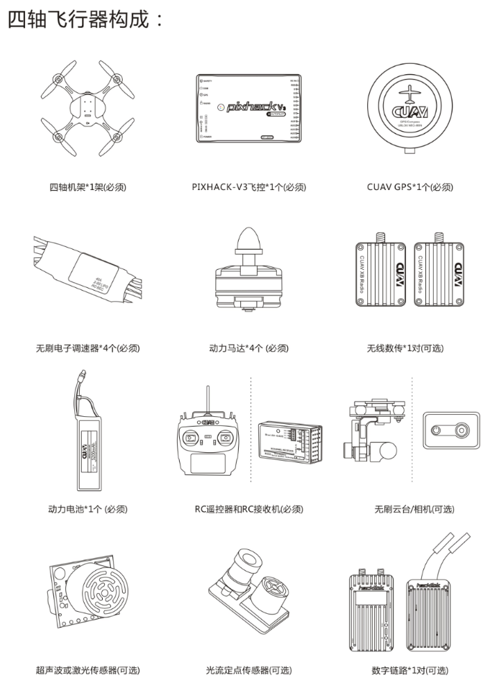
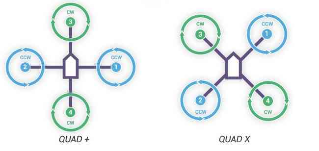

# 无人机编队

## 组装一架满足编队需求的飞机:
通常一个多旋翼组成包括以下硬件(四轴):

### 一个四轴飞行器的构成：
1. 四轴机架 X1（必须）

2. 动力马达 X4 （必须）

3. 无刷电子调速器（电调/ESC）X4 （必须）

4. PixhACK v3 飞控 X1 （必须）

5. CUAV GPS X1 （必须）

6. 无线数传 (CUAV RADIO/XBEE/XTEND/HACKLINK/WP-LINK） X1对 （必须）

7. 动力电池（必须）

8. RC遥控器和RC接收机（必须）

9. 无刷云台或者相机（可选）

10. 超声波或者激光传感器（可选）

11. 光流定点传感器（可选）

### 支持电池类型

使用标配的CUAV IV模块，支持标准2-6V动力电池

IV模块支持2-6V电压、0-60A电流 实时监测

理论上：

需要实时控制能飞行的高度和距离:跟动力续航时间、遥控器或者数传通讯距离有关

自主飞行的高度和距离：跟动力、续航时间有关

### PixHack飞控板设备接线定义	
每种飞行器的电动机顺序 (里边的数字对应的飞控板的PWM输出端口)

CW 顺时针螺旋桨，绿色图示

CCW逆时针螺旋桨 ，蓝色图示

注意：错误的接线和固件，都会导致起飞就翻车，或者严重往一边倾斜，需要谨慎安装和选择固件

### 四轴飞行器:

这种H型机架，应该配置X型模式

## 软件及嵌入式系统配置

  飞控的Telem2接口与RaspberryPI的UART通过3-pin twisted cable连接，RaspberryPI与XBee(本项目采用XBee pro s1)通过USB cable相连。为了使三者能够正常通信，须按照以下步骤进行配置。

### RaspberryPI配置参考  
#### 1. 树莓派操作系统(注:本项目采用带有图形界面的Ubuntu MATE 16.04 for RaspberryPI 3B，其他的OS配置方法可能不同)

1) SD卡格式化软件SD Formatter 4.0 for SD/SDHC/SDXC

2) 系统镜像文件在Ubuntu mate官网上下载，写入SD卡的软件Win32 Disk Imager

3) 安装操作系统时，勾选开机自动登录。(实现auto-login)

4) 操作系统安装完成以后，下载文本编辑器gedit，方便后续更改配置文件。
sudo apt install gedit

#### 2. 将UART启用为communication interface。
  1) sudo gedit /boot/cmdline.text

  2) 删除语句‘console=serial0,115200’保存并退出。
#### 3. 修改UART配置，关闭蓝牙（注:mate系统默认蓝牙占用UART）

1) sudo gedit /boot/config.txt

2) 修改init_uart_clock to 16MHz以及init_uart_baudrate to 921600并删除语句前面的注释符号#。（注:飞控Telem2波特率也要相应地修改为921600）

3) 在文本下面添加语句‘core_freq = 250’

4) 在文本下面添加语句‘dtoverlay=pi3-disable-bt’保存并退出

5) sudo systemctl disable hciuart
 sudo reboot

 重启后UART配置完成
 
#### 4. 安装Python包和Linux包。（注:mate系统自带python 2.7环境）

1) sudo apt install python-pip python-dev
sudo pip install pip dronekit xbee numpy gps pyzmq –-upgrade

2) sudo apt install python-serial

#### 5. 开启ssh。

1) sudo apt install openssh-server openssh-client

2) sudo raspi-cofig

3) 出现配置界面，选择‘network’。

4) 选择‘ssh enabled’。
#### 6. 设置开机自启程序。(确保auto-login已实现)

1) sudo gedit /etc/rc.local

2) 在文件中添加
cd /AmazeFly
python onboard.py -xbee /dev/ttyUSB –pix /dev/ttyAMA0，保存退出

### XBee配置参考

#### 1. 固件烧写

(1) 下载工具XCTU

(2) 烧写DigiMesh固件(注:推荐8073 – Xbee DiGiMesh 2.4)

#### 2. 将配置文件导入XBee

## 编队程序解析

### Introduction

Welcome to the AmazeFly project! "AmazeFly" is a multi-copter drone test platform originally designed by Amazegroup, NCEPU.

The " AmazeFly " drones take the [Pixhawk](pixhawk.org) and the [ArduPilot](www.ardupilot.org) stack as their low-level flight  controller and use [dronekit-python](python.dronekit.io) as the high-level application control. So far there is no modification at the Pixhawk and the ArduPilot level, so this project is purely written in Python running on a Linux companion computer (e.g. Raspberry Pi).

The "AmazeFly" drones use [XBee](https://www.digi.com/products/xbee-rf-solutions/2-4-ghz-modules) modules to establish a high-level communication network between the drones and the ground control station. 

### License

AmazeFly Project is made available under the permissive open source Apache 2.0 License.

### Coding convention

This project is entirely written in Python 2.7, under the convention of [Google Python Style Guide](https://google.github.io/styleguide/pyguide.html).

---

### System requirement

#### Drone

1. A multi-copter drone using Pixhawk as its flight controller.

2. A mini onboard Linux companion computer. (e.g. Raspberry Pi)

3. An XBee module with a USB adapter. (e.g. XBee S1, XBee S2C, etc.)

    __Note:__ Zigbee's are not recommended as they are relatively slow and have small data throughput volume. Zigbee modules tend to get stuck often. The XBee Pro S1 with DIJI Mesh firmware is tested to be working very well. A new hardware upgrade by DIJI unifies XBee and Zigbee to "S2C" version, which are now compatible across all the DIJI product lines.

4. (Optional) A USB-TTL adapter for debugging (e.g. FT232, CP2102/CP2104, do not use PL2303)

__Connection example:__ The XBee modules is connected to the RPi via USB, and the Rpi is conected to the Pixhawk via UART. Configure the hardware UART on the Rpi to run at 921600bps baudrate, consistent with the setup on Pixhawk's serials. See [Companion Computers](http://ardupilot.org/dev/docs/companion-computers.html) page in the ArduPilot dev wiki.

#### Ground control station

1. A Linux computer. (Virtual machines are okay)

2. An XBee module with a USB adapter. (e.g. XBee S1, XBee S2C, etc.)

#### Packages

1. Linux packages: python-pip python-dev python-serial python-gps gpsd gpsd-clients

2. Python packages: dronekit dronekit-sitl xbee numpy pyzmq

### The main composition of the project

gcs.py: The ground control station script for the quadcopter flocking control experiment.

onboard.py: Onboard main script for the multi quadcopter flocking control experiment.

comm.py: Communication classes and functions.

mas.py; Multi-agent system control algorithm module.

nav.py: Navigation functions.

shared.py: Attributes shared across the files.

util.py: Utility functions.

missionparser.py: Upload the missions.

PWMController.py: Turn on or turn off the LED on the drones.

mission_txt: The directory to place some TXT files of the missions.

--------------------------------------------------------------

### How to use

1.Plan a mission:

Software: APM Planner 2.0

Steps:

      (1)Run the software.

      (2)Click 'FLIGHT PLAN'.

      (3)Click on a point on the map(with number of 0)  as the 'Home Origin'.

      (4)Click the 2nd point(with number of 1) as the 'Takeoff' point.

      (5)Continue to click some points as the waypoints.

      (6)Altitudes, accuracis and headings of the points can be changed in the lower part of the pages.

      (7)Copy the generated TXT files to the mission_txt directory and divide them by the serial numbers of the drones.(The TXT files's names must be 'FIRST.txt', 'SECOND.txt' or 'THIRD.txt'.)

Reference: http://ardupilot.org/planner2/

2.Run onboard.py :

The `onboard.py` script will run automatically when the power of the drone is switched on.

3.Control the drones through gcs.py:

(1)Turn on the computer.

(2)Connect the linux computer with the Xbee module.

(3)Run the Terminal.

(4)Use the command 'cd'to enter the project directory.

(5)Run the `gcs.py` script by `sudo python gcs.py -xbee /dev/ttyUSB0 `. Use `--help` or refer to the source code docstrings for detailed script arguments.

(6)The console will start prompting some information. Input keys accordingly to execute certain operations.

    Keylist:

        'x': 0,  # switch the mode to auto

        '1': 1,  # the first mission

        '2': 2,  # the second mission

        '3': 3,  # the third mission

        'l': 4,  # landed

        'd': 5,  # light-high level

        'k': 6,  # kill thread and restart

    A normal takeoff sequence should be:

    1). press `'1'/'2'/'3'` to choose the first/second/third mission.

    2). press `'x'` to switch the mode to auto and take them off.

    3). press `'d'` to turn on the LED.

    4). press `'l'` to directly land the drones.

    5). press `'k'` to kill thread and restart.
