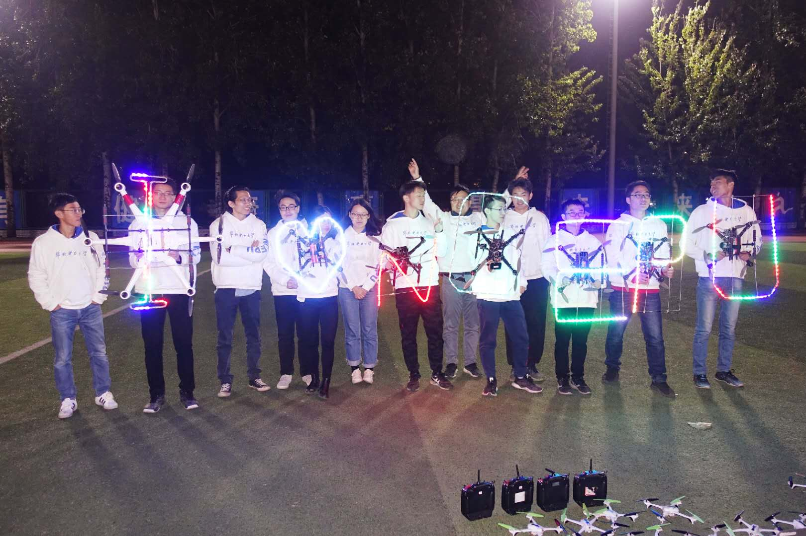
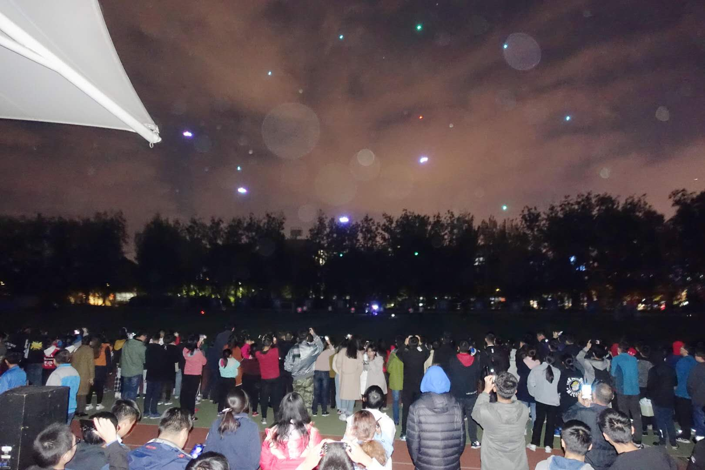
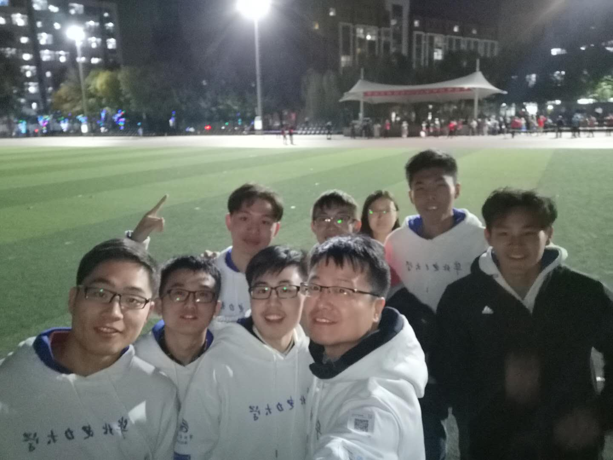

创新展示
========

-2018年10月27日晚，由控计学院吴华老师带领的AMaze（amazething.io）师生创新团队在华电操场上空上演了一场精彩的无人机编队灯光秀，为母校60华诞献上生日祝福。学院党委书记刘威、常务副院长房方莅临现场，超过2000名师生校友观看了现场表演。
无人机在天空组成I ❤ N C E P
U的字样，迎着夜空升起，在空中散发绚丽的色彩，华电学子对母校的爱和祝福萦绕心头。

|image0|
-这些夜空的精灵时而穿梭变换成“□”阵型形成凝聚力极强的团体，时而悄悄地摆出“❤”阵型表示对知识的追寻，时而组成“ϟ”符号展示出华电的特色。

-在夜空中，N C E P
U这五个字母被精灵们围绕在空中造出一个巨大的校徽，在地球表面以最特殊的方式向全球华电学子展现了母校的思念与关怀。

-无人机慢慢组成“六十”的字样。再次把整个表演推向了高潮。在这六十字样的背后，有无数华电校友用智慧和生命创造着全球能源电力的奇迹。全球顶尖的电力人才汇集于此，共祝华电60岁生日快乐！夜幕降临，华电六十华诞的脚步愈来愈近，星光闪烁，那是无人机点燃了夜空中的生日蜡烛，时间定格在这个瞬间……
|image1|
-Amaze团队还将开源本次编队的所有文档资料和代码。欢迎关注AMaze微信公众号、团队网站。期待下一个创造Amazing
thing的你加入团队！ |image2|

